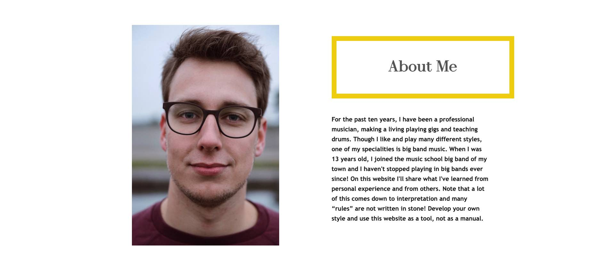

# Fundamentals of Big Band Drumming
## Portfolio Project 1: HTML/CSS Essentials

This project is built as part of the Code Institute Full Stack Software Development course. For this course, 
Dirk Ornée had to build a first Portfolio Project. He choose to build a project that combines his knowledge as a professional musician, with his knowledge gained troughout the course. 

## Live Site
[Fundamentals of Big Band Drumming](https://dodrums.github.io/PortfolioProjectOne/index.html)

## Repository
https://github.com/DOdrums/PortfolioProjectOne

***

## Table of Contents

- [Fundamentals of Big Band Drumming](#fundamentals-of-big-band-drumming)
  - [Portfolio Project 1: HTML/CSS Essentials](#portfolio-project-1-htmlcss-essentials)
  - [Live Site](#live-site)
  - [Repository](#repository)
  - [Table of Contents](#table-of-contents)
- [UX](#ux)
  - [Business goals](#business-goals)
  - [Target Audience](#target-audience)
  - [User Stories](#user-stories)
    - [As the owner:](#as-the-owner)
    - [As a new user:](#as-a-new-user)
    - [As a returning user:](#as-a-returning-user)
  - [Structure of the website](#structure-of-the-website)
  - [Color Scheme](#color-scheme)
  - [Features](#features)
    - [Home Page:](#home-page)
    - [Reading & Playing page](#reading--playing-page)
    - [Three Drummers page](#three-drummers-page)
    - [Contact page](#contact-page)
  - [Future Features](#future-features)
    - [Styles](#styles)
    - [Sounds](#sounds)
    - [Technique](#technique)
    - [Hamburger Menu](#hamburger-menu)
    - [Differenly sized sheets for smartphone sizes](#differenly-sized-sheets-for-smartphone-sizes)
    - [Working Contact form](#working-contact-form)
- [Credits](#credits)
  - [Code](#code)
  - [Images](#images)
    - [Reading and Playing page](#reading-and-playing-page)
    - [Three Drummers page](#three-drummers-page-1)
    - [Contact page](#contact-page-1)
  - [Media](#media)
- [Technologies used](#technologies-used)
- [Testing](#testing)
  - [Functionality testing](#functionality-testing)
  - [Compatibility testing](#compatibility-testing)
  - [User stories testing](#user-stories-testing)
    - [As the owner:](#as-the-owner-1)
    - [As a new user:](#as-a-new-user-1)
    - [As a returning user:](#as-a-returning-user-1)
  - [Performance testing](#performance-testing)
  - [Code validation](#code-validation)
  - [Bugs](#bugs)
  - [Deployment](#deployment)

# UX
## Business goals
The main goal for this project, is to develop a valuable resource for drummers and conductors, to learn about big band drumming. The website should be able to provide a helicopter view of what big band drumming is like, how it should be approached and what it should sound like. This should help conductors in giving pointers to drummers during rehearsals and should improve the playing of big band drummers who aren't very experienced yet.
The second goal is to show my competency as a developer using HTML & CSS.

## Target Audience
Drummers and Conductors are the main target audience, since the website really aims to help them specifically in understanding the function of a big band drummer better. However, anybody with some knowledge or just a general interest in big band music should be able to enjoy this website and learn something.

## User Stories

### As the owner:

* I want to share my knowledge about big band drumming and keep everything I have learned over the years in one place (the website).
* I want the user to really dive in, get interrested in the topic and get inspired to do more research by themselves.
* I want the user to learn the fundamentels of big band drumming through this website, so they can use this information in a pragmatic way to develop their own style and preferences. 
* I want to build a relationship with users, where they can contact me through the contact form if they have more questions, so I can help them out with anything drumming related. 

### As a new user:
* I want to navigate the site easily and intuitively, without having to wonder what the purpose of the site is.
* I want to be redirected through the pages in an intuitive way, having a logical hierarchy to follow in order to learn everything I can from the website 
* I came to this website specifically to learn about big band drumming, especially about topics within big band drumming which are hard to find recources for.

### As a returning user:
* I want to return to the information, to see if I'm already incorporating everything in my playing or conducting. 
* I want to re-listen to the audio, to see if now that I have tried to use the information in practice, I start to recognize more of the information learned in the audio itself.
* I want to contact the author, for any further questions I have.

## Structure of the website

The website is designed to give a good hierarchical flow. This means that after reading the homepage, the user will go to the second page (Reading & Playing) and read through this information. On the bottom of that page they will be prompted to continue to the Three Drummers page, which is the logical place to continue, as it builds on the information read in the Reading & Playing page. The pages however can also be used just by themselves, they both contain enough information to stand on their own. 
Furthermore, the website is made fully responsive, so it functions on any device. That being said, as you'll be reading sheet music on the Reading & Playing page, a bigger screen is more fitting for that type of content. 

## Color Scheme
The Color Scheme was chosen to represent a somewhat old fashioned look, especially since a lot of the images are black and white, which could look weird on a very modern looking website. To make the website not appear boring, a bright yellow (Safety Yellow) was used.
The main color palette can be seen below:

Of this color pallette the following colors were used:
* Eerie Black
* Cultured
* Safety Yellow

A secondary color palette was used for extra colors:

Of this color palette the following colors were used:
* Davy's Grey
* Pale Silver

## Features

Before this project was started, a MoSCoW-method style table was made to see which global features should be added and which features would be omitted or added at a later date. You can see said features in the image above. Let's have a look at the features that actually made it to the website:

### Home Page:
The home page is where the user will learn about the project and it's function. Right at the top is a nav bar, making clear which sections the website is divided in. The current active page will be underlined in yellow and user will get a conformation that other links work when hovering over them, by temporarily having hovered link underlined yellow:

Right below the nav bar we find the title and cover text, with a captivating hero-image behind it. The cover text is writen short and concise, but with a clear explanation of the website's main goal: 

Next is the About Me section, which explains quickly who the author is and why he wrote this website. You'll also see a picture, to put a face to the name:

Underneath the about me section, you'll find a video of Buddy Rich playing an impressive drum solo! This video is meant to attract the attention of the user and make them want to learn more about big band drumming: 

Finally we have the footer section. This footer section features four socials links, in case user wants to get to know more about the author:

### Reading & Playing page

The reading and playing page starts of with an introduction explaining that on this page you will learn how to interpret notes as a big band drummer. It also mentions you should know how to read sheet music in order to take full advantage of the information on this page. There is an image of famous drummer Sonny Payne with a hyperlink to Wikipedia in case you want to learn more:

Next user will start reading all about big band drumming and get sheet music examples to see what a drum sheet looks like, with explanations about what everything on the sheet means:

Sroll further and user will find the first audio example. These audio examples are used to give a live example of what the drumming sounds like and to connect the theory to the practice:

At the end of the page multiple lists are introduced to sum up some simple best practices for playing big band music. These lists give the user a clear overview of what is important to know about big band drumming and is a good place to return to a second time, when refreshing their knowledge about the topic:

Notice that on the side of the page, there is a little button with an arrow in it. This button will bring you back to the top of the page when clicked:

### Three Drummers page

The three drummers page is similar in layout and features to the Reading & Playing page, sporting an intro, text and audio examples. On this page though, instead of sheet music, you'll find nice oversized images of each drummer covered on this page:

### Contact page
On this last page, you'll find a contact box where the user can input their information and ask the author a question. For the author's convenience a 'Profession/Instrument' box was added, so author can tailor make his response to any questions. 

## Future Features
### Styles
In the three drummers page, three different ways of playing big band music are discussed. However, these three different ways all fall inside a quite similar big band style. There are different styles of big band music and playing, that fall outside of my expertise, but could be added in a seperate page to at least familiarise the user with them. 
### Sounds
On the three drummers page, the drum kits that are used by the drummers are briefly discussed. A seperate page dedicated to what kind of sound different drum kit make could be made, covering how to tune your drum kit in different ways as well and what to look for in a good jazz cymbal. 
### Technique
This page would be specifically for drummers and discusses what kind of drumming techniques to use to get a good swinging feel and sound. 
### Hamburger Menu
Since Javascript wasn't used inside this project, a hamburger menu couldn't be made. In a future release (outside of the course), this could be added for better usability on smartphones. 
### Differenly sized sheets for smartphone sizes
Although the sheet music is readable on a phone when held in landscape mode, it doesn't read nicely when in portrait mode. This could be mitigated by cutting up the sheets in smaller portions, and aligning these portions underneath each other. However, with the sheets currently used, this could not be done, since the resolution was not high enough and the pictures were slightly warped (new sheet music could be custom-made to mitigate this).  
### Working Contact form
Although the contact form is build up properly, there was no back-end section in this project. This means the information is not sent anywhere. In a future update this functionality could be added, so the author actually recieves any input by users. 

# Credits

To be able to build this project in gitpod, I used the template made by Code Institute, as found here: [full template](https://github.com/Code-Institute-Org/gitpod-full-template)

Other websites I used for inspiration and general coding examples and knowledge:
* [w3schools](https://www.w3schools.com/)
* [awwwards](https://www.awwwards.com/)

## Code
* Nav bar inspiration and hero-image animation was taken from the love running walkthrough project
* The CSS code `margin-left: calc((100% - 600px) / 2);` to center paragraphs on page 2 and 3 was taken from the NYtimes website, which uses this code to center text in their articles
* The CSS code to make the youtube video responsive for screen sizes 767px and under, was taken from this website: [make youtube video responsive](https://avexdesigns.com/blog/responsive-youtube-embed) 
* The javascript code for the back to top button was taken from this website: https://codeconvey.com/floating-back-to-top-button-html/ 

## Images
### Reading and Playing page
* [Sonny Payne](https://www.google.com/url?sa=i&url=https%3A%2F%2Fwww.drummerworld.com%2Fdrummers%2FSonny_Payne.html&psig=AOvVaw2bWMD7woDaYUibaL3AcNO6&ust=1646920023056000&source=images&cd=vfe&ved=0CAsQjRxqFwoTCMCqyaiVufYCFQAAAAAdAAAAABAD)
### Three Drummers page
* [Count Basie](https://photos.com/featured/count-basie-in-made-in-paris-bettmann.html)
* [Mel Lewis](https://www.google.com/url?sa=i&url=https%3A%2F%2Fstuartnicholson.uk%2Fmel-lewis-2%2F&psig=AOvVaw0w5kHGuDkLF0mSZYWRtQUU&ust=1647101577681000&source=images&cd=vfe&ved=0CAsQjRxqFwoTCKiSvdm5vvYCFQAAAAAdAAAAABAD)
* [Butch Miles](https://www.google.com/url?sa=i&url=https%3A%2F%2Fwww.namm.org%2Flibrary%2Foral-history%2Fbutch-miles&psig=AOvVaw0AX3haz_d2_Frot9bgQI5h&ust=1647103356646000&source=images&cd=vfe&ved=0CAsQjRxqFwoTCKCP5LPAvvYCFQAAAAAdAAAAABAD)
* [Sonny Payne](https://scontent-amt2-1.xx.fbcdn.net/v/t31.18172-8/18278341_1175291792581504_6415546467369244938_o.png?_nc_cat=105&ccb=1-5&_nc_sid=9267fe&_nc_ohc=TIDBaAeT5uEAX_Vomst&_nc_ht=scontent-amt2-1.xx&oh=00_AT8m9VzlClA64XBLo14HZjxb1t1mZLOIEHBMThotvUsKgA&oe=624FB9D1)
### Contact page
* [Count Basie Big Band](https://www.google.com/url?sa=i&url=https%3A%2F%2Fwww.last.fm%2Fmusic%2FCount%2BBasie%2B%26%2BHis%2BOrchestra&psig=AOvVaw3gib7PEU6RCHmW6z8rne8H&ust=1647618925218000&source=images&cd=vfe&ved=0CAsQjRxqFwoTCKC-i_nAzfYCFQAAAAAdAAAAABAD)

Any other images displayed on the website were shot by the author.

## Media
* Audio examples were taken from author's personal music library.

# Technologies used
[HTML](https://html.spec.whatwg.org/) - for basic structuring and semantic markup of the document.
[CSS](https://www.w3.org/Style/CSS/Overview.en.html) - to provide styling to all the pages.
[Preview (Mac)](https://support.apple.com/guide/preview/welcome/mac) - for converting images to smaller file sizes.
Color Palette generator for generating the color schemes.
[Font Awesome](https://fontawesome.com/) - for items used in footer and back to top button.
[Awwwards](https://www.awwwards.com/awwwards/collections/free-fonts/) - for the heading font.
[Gitpod](https://www.gitpod.io/) - used to connect a browser based VScode to github.
[Github](https://github.com/) - used for version control and deployment of the website.
[Multi Device Website Mockup Generator](https://techsini.com/multi-mockup/index.php) - to create an image of the website shown on different devices.

# Testing
## Functionality testing 
Throughout developing the website I mostly used Chrome developer tools to solve issues and try out news styles. Since you see the results immediately, it is a faster way of working than adding code to your project and refreshing your page after every step. Every once in a while I'd open the website in Safari, to make sure it was also functional in this browser, since Safari is notorious for having the worst HTML support.  
## Compatibility testing
The site was tested by myself on an iPhone 8 and a 15 inch Macbook Pro. Friends and family also tested the website on Windows Desktops, the original (small) iPhone SE, and Android devices. No problems or responsiveness issues were found. 
## User stories testing

### As the owner:

* I want to share my knowledge about big band drumming and keep everything I have learned over the years in one place (the website).
  - I was able to make a well structured website with clear information about big band drumming. Most of the relevant information I know, can be found on this website. 
* I want the user to really dive in, get interrested in the topic and get inspired to do more research by themselves.
  - The video on the homepage should captivate the user and make them want to dive in to the material deeper.
* I want the user to learn the fundamentels of big band drumming through this website, so they can use this information in a pragmatic way to develop their own style and preferences. 
  - User can learn through text, sheet music and audio. It is well structured and easy to digest information.
* I want to build a relationship with users, where they can contact me through the contact form if they have more questions, so I can help them out with anything drumming related. 
  - User can find a dedicated contact page urging user to contact author in case they have any more questions. 

### As a new user:
* I want to navigate the site easily and intuitively, without having to wonder what the purpose of the site is.
  - Purpose of page is explained to user in the cover text. After that, user can read a short intro about the author and watch a short video that displays some high quality big band drumming. User should be ready to dive in to the information expecting more information about big band drumming.
* I want to be redirected through the pages in an intuitive way, having a logical hierarchy to follow in order to learn everything I can from the website
  - User will feel a natural flow throughout the page, having to only scroll down through the two main information pages and being urged to continue with the Three Drummers page after finishing the Reading & Playing page. 
* I came to this website specifically to learn about big band drumming, especially about topics within big band drumming which are hard to find recources for.
  - User is expected to already have some knowledge about music and (playing) drums. It is meant as a specialized resoure where user can learn about big band drumming that are hard to find in other sources. 

### As a returning user:
* I want to return to the information, to see if I'm already incorporating everything in my playing or conducting. 
  - Information is structured in bite sized portions, makeing it easy to return to the information and look for a specific section, in case user wants to revisit certain information.
* I want to re-listen to the audio, to see if now that I have tried to use the information in practice, I start to recognize more of the information learned in the audio itself.
  - Audio will be available easily and is fully user controlled, making it easy re-play or forward through the music.
* I want to contact the author, for any further questions I have.
  - User can find a dedicated contact page on the website.

## Performance testing
I used the Lighthouse tool in Chrome Developer Tools to test certain key factors of the website troughout development. This helped me to spot errors or possibble improvements and mostly helped me in keeping the website fast and the code up to snuff with current best practices. Scores can be seen in the image below:

## Code validation
To validate the code I used the following two tools:
[Nu Html Checker](https://validator.w3.org/nu/)
[W3C CSS Validation Service](https://jigsaw.w3.org/css-validator/)

Both validators returned no significant errors on any of the pages. 

## Bugs
* After finishing page 2 of the website, I noticed that the line underneath the nav bar was suddenly cut in half. This was caused by a bottom-margin property being added to the main font selector (which includes the nav element). This was solved by making a selector that contains a negative bottom-margin to the ul and il child elements of the nav element and by adding a nav selector that contains a bottom-margin of 0.
* The thumbnail of the youtube video would dissapear in and out of frame partially when resizing the window. After some playing around in the chrome dev tools, I discovered this was due to the width being set to a percentage setting instead of pixels. I changed it to pixels and now the thumbnail stayed sized the same no matter the window size.
* There was a problem with the hero image after resizing it to fit tablet sizes. The hero image was now zooming into the div below instead of behind it. This was because I changed the height setting of hero-image id but not of the hero-outer id.
* There was a problem with the figcaption under the count basie image not aligning. This happened because I moved around CSS rules insize the media query section, and misplaced a bracket because of that. This misplaced bracket made two CSS rules fall outside of the media query and were now applied project-wide. It took a while to find what caused this, but Chrome Developer tools made it quite easy to see that the wrong styles were being applied at bigger screen sizes.

## Deployment

The site was deployed through Github Pages. Connected to Github was Gitpod, which features a browser based VScode. For the most part I used the connection to Gitpod with a desktop VScode, since I have VIM and other extensions installed, which didn't work in the browser based version. 

To the deploy the project, I had to:
* Go to settings in github
* Scroll down to Pages
* Select the main branch
* Hit save to deploy the website

To test the website locally while building:
* Open terminal in the open VScode project
* Start http server by typing 'python3 -m http.server' into the terminal window
* Click the 'Open Browser' button that appears

